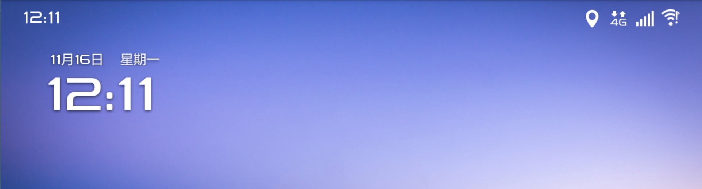

# 时钟widget

要做一个时钟`widget`如图所示



[`widget`开发已经做过了很简单](http://blog.csdn.net/lucky9322/article/details/73301964).

~~很自然的方式在`service`里用`Timer`做个定时刷新就好了~~

```
        timer.schedule(new TimerTask() {

            @Override
            public void run() {
                updateView();
            }
        }, 0, 1000);
```

**但是这样会加重launcher的工作launcher的`shortcutandwidgetcontainer`会被频繁调用**


## 用系统广播实现

```
  <action android:name="android.intent.action.DATE_CHANGED"/>
  <action android:name="android.intent.action.TIME_SET"/>
```

这两个广播分别会在系统时间刷新和修改系统时间的时候会被回调.

但是需要注意的是

```
 <action android:name="android.intent.action.TIME_SET"/>
```

这个广播不能静态注册.

	原因：
	
	1.提高系统效率：这两个事件是Android的基本事件，如果大多数程序监听，会大大的拖慢整个系统，所以android不鼓励我们在后台监听这两个事件。 
	2.因为有序广播的优先级问题。以上这些广播中，静态注册时，系统的优先级大于应用，并且系统阻止了广播的向下传播。又因在Android 的广播机制中，动态注册的优先级是要高于静态注册优先级的。故用动态注册代替静态注册。 
	3.系统安全问题。
	4.不能静态注册的广播还有以下几个：
		android.intent.action.SCREEN_ON 
		android.intent.action.SCREEN_OFF 
		android.intent.action.BATTERY_CHANGED 
		android.intent.action.CONFIGURATION_CHANGED

	5.解决方式（以android.intent.action.SCREEN_ON为例）： 
	动态注册不能放到activity中，因为动态注册必须要在activity消亡的时候调用unregisterReceiver，会随着activity 的解锁消失而不能再接收广播。一般的办法是在activity起来后马上start一个service,这个service里动态注册一个broadcastreceiver，broadcastreceiver里接收到SCREEN_ON消息后启动锁屏activitty 为了保证 broadcastreceiver任何时候都可以接收到SCREEN_ON，service必须常驻在系统内，所以要接收开机消息 android.intent.action.BOOT_COMPLETED。


### 实现
基于以上考虑在`widget`添加的时候启动`service`并完成广播监听.在广播的`onReceive`方法中完成widget时钟的刷新操作.

```
   BroadcastReceiver timeTickReceiver = new BroadcastReceiver() {
        @Override
        public void onReceive(Context context, Intent intent) {
            Log.d(TAG, "broadcastReceiver==" + intent.getAction());
            ClockWidgetUtil.updateView(ClockService.this);
        }
    };
```

[完整代码]()